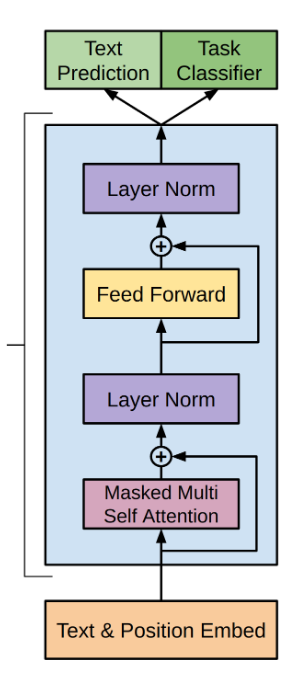

# GPT From Scratch

This project is a custom implementation of a Generative Pre-trained Transformer (GPT) model built entirely from scratch using PyTorch. The model is designed for character/word-level text generation and is trained on Shakespeare's *Hamlet*.

## Architecture Overview

The model follows the core principles of the Transformer architecture, specifically focusing on the decoder-only setup typical for generative tasks like GPT. 



### Key Components (`GPT.py`):
- **Embedding Layer**: Maps input tokens to a dense vector space.
- **Positional Encoding**: Injects positional information into the sequence using sine and cosine functions.
- **Masked Multi-Head Attention**: Implements self-attention with a triangular causal mask to prevent looking ahead at future tokens.
- **Feed Forward Network**: A two-layer fully connected network applied to each position separately.
- **Layer Normalization**: Applied before and after the sub-layers for stabilization.

## Dataset

The model is trained on a text file, `hamlet.txt`. 
The text is preprocessed by:
- Tokenizing words using `nltk.tokenize`.
- Removing specific punctuation and keeping alphabetic words.
- Converting words to numerical sequences using `keras.preprocessing.text.Tokenizer`.
- Generating input sequences where the model learns to predict the next word.

## Installation & Requirements

Ensure you have the following libraries installed:
```bash
pip install torch numpy pandas nltk tensorflow scikit-learn
```

If you are using NLTK for the first time, you may also need to download the `punkt` tokenizer:
```python
import nltk
nltk.download('punkt')
```

## Usage

To train the model and evaluate its test accuracy, simply run the `Train.py` script:

```bash
cd GPT
python Train.py
```

The script will:
1. Load and preprocess `hamlet.txt`.
2. Build vocabulary and token sequences.
3. Initialize the `transformer` model.
4. Train the model using the Adam optimizer and CrossEntropy loss.
5. Print training loss per epoch and evaluate accuracy on the test set.

## Project Structure

- `GPT/GPT.py`: Contains the building blocks for the architecture (Embeddings, Positional Encoding, Attention Mechanism, FeedForward).
- `GPT/Train.py`: Handles data loading, tokenization, model initialization, training loop, and evaluation.
- `hamlet.txt`: The corpus used for training (ensure it is placed in the project root or adjust the path in `Train.py`).
- `Complete_GPT_Scracth.ipynb`: A complete Jupyter Notebook containing the full implementation and tests.
